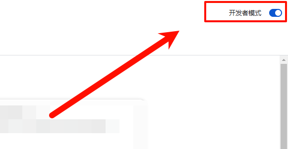
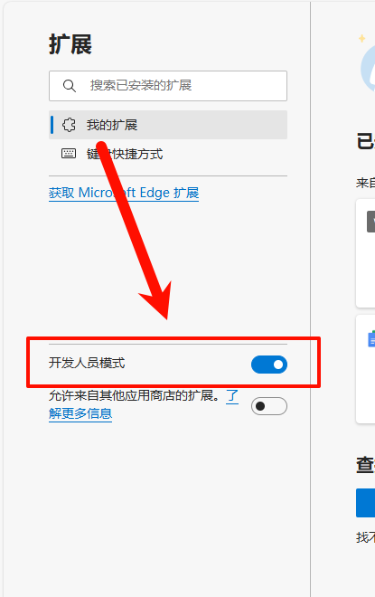
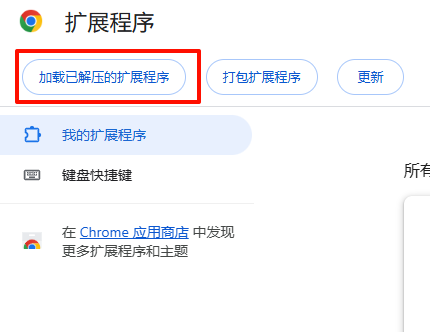

# Workerman Doc Dark Theme - 为Workerman文档添加深色主题

这是一个浏览器插件，能够为https://www.workerman.net/doc/的文档提供深色主题，防止半夜亮瞎眼睛

## 如何使用

- 下载本仓库中的代码
- 进入浏览器的插件管理页面
    - Chrome: [chrome://extensions/](chrome://extensions/)
    - Edge: [edge://extensions/](edge://extensions/)
- 开启开发者模式
    - Chrome: 在页面的在右上角
        

    - Edge: 在页面的左侧  
        

- 加载插件
    - Chrome: 选择加载已解压的扩展程序，选择下载并解压后的代码文件夹，然后添加即可
        
        
    - Edge: 选择加载已解压的扩展程序，选择下载并解压后的代码文件夹，然后添加即可
